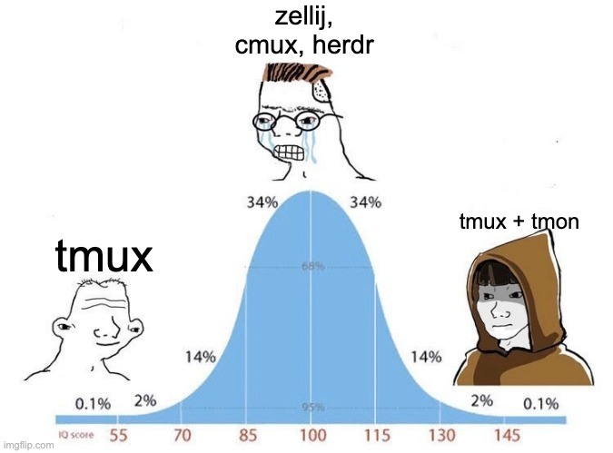

# 📡 tmon, zero-config agents fleet manager for tmux



You've got Grok Build crunching through a refactor in one pane, Claude Code
negotiating a design doc in another, and Hermes Agent off doing… whatever
Hermes Agent does. Wouldn't it be nice to know who's actually working, who's
stuck waiting for your approval, and who's just daydreaming?

tmon sits quietly in your tmux status bar and tells you exactly that. It
finds every running AI coding agent across your panes, tracks whether it's
**working**, **idle**, or **blocked** on you, and shows a compact
color-coded count. Need details? Hit `prefix a a` for an interactive
dashboard — or just **click the status bar indicator**.

[](https://github.com/guillaumemeyer/tmon/releases)
[](LICENSE.md)
[](https://github.com/guillaumemeyer/tmon/actions/workflows/ci.yml)


## Features

- 🚦 **Status bar** — the whole zoo on one compact, color-coded line: 🤖 your fleet, 🚨 blocked (*"waiting for you — it has opinions"*), ⚡ working (*"in flow, do not disturb"*), 💤 idle (*"napping between thoughts"*). Click it to open the dashboard.
- 🖼️ **Pane highlighting** — agent panes wear a status-colored border strip (🚨 blocked, ⚡ working), so the needy ones stand out without reading a single line of output.
- 🚨 **Blocked? You'll know.** — a red 🚨 means an agent is waiting on *you*; no more silent standoffs with Claude.
- 🚀 **Teleport** — `Enter` (or a click) in the dashboard drops you straight into the agent's pane. No more `tmux list-panes` archaeology.
- 📊 **Three dashboard views** — flat list, grouped by project, or grouped by status. Press `v` to switch; the choice sticks.
- 🔍 **Fuzzy search** — Telescope-style matching over names, directories, branches, PR numbers, and even pane content.
- 📊 **Context gauges** — a live progress bar shows each agent's context window filling up, with a ⚠️ before it goes supernova.
- ⏳ **Quota monitoring** — a background worker probes your Claude, Grok, and Codex account quota (plan tier, % used, next reset) once per 15 minutes and shows it in the dashboard's stats line. Auto-spawns from the first status poll; no setup.
- 🎨 **Live themes** — preview Catppuccin, Nord, Dracula and friends right in the popup, apply with `Enter`.
- 🕵️ **Hide the noise** — glob patterns drop agents you don't care about from the status bar and dashboard. The agent keeps running; you just stop seeing it.
- 🩺 **`tmon doctor`** — one command that checks everything and explains itself in plain text (or JSON, for the CI crowd).
- 📐 **Fit-to-width preview** — press `f` inside the dashboard to wrap long captured lines to the preview width instead of cutting them at the edge. The choice persists.
- 🤖 **11 agents and counting** — Grok Build, Claude Code, Codex CLI, Cursor, Cline, Aider, Copilot, CodeBuddy, Windsurf, Hermes Agent, OpenClaw.


## Install

```bash
curl -fsSL https://raw.githubusercontent.com/guillaumemeyer/tmon/main/install.sh | sh
```

Adds the TPM plugin line

```tmux
set -g @plugin 'guillaumemeyer/tmon'
```

to `~/.tmux.conf` at the right place when it is not there yet (before the
TPM initializer, or grouped with your other plugins). It does not install
TPM and does not run tmux. If you do not have TPM yet, install it and press
`prefix + I` inside tmux to clone and load tmon. Safe to re-run.

See "Alternative installation modes" if necessary.

## What tmon won't do

- Won't feed your agents
- Won't pair your socks or approve `rm -rf /` for you
- Won't start agents, stop agents, or "just send a quick prompt"
- Won't auto-merge PRs written by three agents at once (we have *some* standards)

tmon is a fleet manager, not a petting zoo.

## Supported agents

tmon watches the whole zoo out of the box — **11 agents**:

🤖 Grok Build · ✳️ Claude Code · 🧩 Codex CLI · 🖱️ Cursor · 🧶 Cline · 🦆 Aider · ✨ GitHub Copilot · 🐾 CodeBuddy · 🌊 Windsurf · 👟 Hermes Agent · 🦀 OpenClaw

How closely tmon can track each one depends on the agent's own state
surface. Agents that publish live state files (Grok, Hermes, Codex CLI,
Cline, CodeBuddy, Aider, OpenClaw) or accept lifecycle hooks (Claude Code,
Cursor, Copilot, Windsurf, Grok, Hermes approvals) give tmon authoritative
working / blocked / idle signals; everyone else falls back to the CPU/IO and
pane-content heuristics. The matrix below shows which features each agent's
connector provides:

| Agent | Connector | Status | Blocked | Detail | Title | Tokens |
|-------|-----------|--------|:---:|--------|:---:|:---:|
| Grok Build | native (`~/.grok`) + hooks | exact | ✓ | phase · tool · permission · model | ✓ | ✓ + window % |
| Claude Code | hooks | exact | ✓ | tool · permission | ✓ | ✓ + window % + quota |
| Codex CLI | native (`~/.codex` rollouts) | exact | ✓ (hooks) | phase · tool · permission | — | ✓ + window % + quota |
| Hermes Agent | native (`~/.hermes` + profiles) | CLI/TUI | ✓ (hooks) | model · approval | ✓ | ✓ + window % |
| GitHub Copilot | hooks, else native fallback | exact | ✓ | tool · permission | — | — |
| Cursor | hooks, else native fallback | exact | — | tool | — | — |
| Windsurf | hooks | exact | — | tool | — | — |
| Cline | native (`~/.cline`) | working | — | session id | — | — |
| CodeBuddy | native (`~/.codebuddy`) | idle | — | session id | — | — |
| Aider | native (`.aider.chat.history.md`) | working | — | editing | — | — |
| OpenClaw | native (`~/.openclaw` + gateway lock) | gateway | — | gateway · N active sessions | — | — |

**Status** is how precisely tmon knows the working / blocked / idle state:
`exact` from the agent's own signals, a partial signal (`working`, `idle`,
`gateway`, `CLI/TUI`), or `heuristic` (CPU/IO inference). **Blocked** marks
connectors that detect a permission wait themselves; a — falls back to the
pane-pattern heuristic (`[y/N]`, permission prompts, …). **Detail** is what
the dashboard shows under the agent's name, **Title** the session name
("Title (Agent)"), and **Tokens** the stats line (tokens + context-window %
when known). **Quota** is the account-level rate-limit windows — % used,
next reset, plan tier — probed in the background by the usage worker for
Claude, Grok, and Codex and shown in the dashboard popup at the top of the preview
pane: a `📊 Usage:` header with one progress-bar row per window (`████ 38% ·
Current session (reset at 19:39 PDT)`), a divider, then a `💬 Session:`
line with the token counts and the context-window bar on its own line
below it. All bars share a four-space left margin so they line up. When
the agent reports no quota windows, the header reads `📊 Usage: ?`.

**Hermes** lists only live **CLI/TUI** sessions (not the messaging gateway).
The dashboard name is `Title (Hermes - <profile>)` when a profile is known
(default home or `~/.hermes/profiles/<name>`). Session title, model, and
token stats come from each home's `state.db`. Dangerous-command waits become
**blocked** when approval hooks are installed (`tmon hooks install hermes`);
Hermes may prompt once to allowlist the shell hook.

Hooks are **off by default** (`@tmon-auto-hooks off`). Install them with
`tmon hooks auto` or `tmon hooks install <agent>` when you want authoritative
status. Codex is read natively from its session rollouts without hooks;
installing them (and trusting them in-session via `/hooks`) adds tool and
permission detail on top. Without hooks, the Cursor/Copilot native fallback
only reports the agent as idle; other agents still use CPU/IO heuristics
across status refreshes.

## Add your agent

Missing your favorite agent? The connector interface is about **15 lines** —
`Name()`, `Enabled()`, `Probe()` — and community connectors are how the
fleet grows (same playbook that made TPM the default tmux plugin story).

See **[CONTRIBUTING.md](CONTRIBUTING.md)** for a copy-paste template, the
detect-signature checklist, and how to land a PR.

## Quota monitoring

The status poll must stay fast and never touch the network, so quota
probing runs in a small background worker that `tmon status` auto-spawns on
its first poll (one fork+exec, well under the poll budget; a flock keeps it
single-instance per state dir). The worker probes the Claude OAuth usage
endpoint, the Grok Build billing endpoint, and the Codex `app-server`
JSON-RPC interface at most once per 15
minutes, writes `<state>/usage.json` (quota blocks; the token ledger lands
here in a later phase), and exits after 30 minutes with no live agents and
no open dashboard. A crashed worker is detected via its heartbeat file and
respawned by the next poll.

`<state>/usage.json` is the worker's only output (schema v1): a `quota`
block per agent with a `windows` list — one entry per reported window
(session, weekly all-models, weekly per-model), each with the percent used,
a display label and the next reset time — plus the plan tier when the API
exposes it and a `statusText`/`authHelpText` pair explaining an absent
window (no credentials, rate limited, …). Claude's windows match its own
/usage view: "Current session", "Current week (all models)", and per-model
windows such as "Current week (Fable)". Each status poll reads it cheaply
and attaches the windows to every live record of that agent (quota is
account-level, so each session of an agent shows the same windows); the
dashboard renders one `████ 38% · Current session (reset at 19:39
PDT)` row per window under the `📊 Usage:` header at the top of the preview
pane (or `📊 Usage: ?` when the agent reports no quota windows), with the
context-window bar on its own line under the `💬 Session:` token counts
below a divider. The ledger fields (`today`,
`recentDays`, `modelUsage`) are reserved for the next phase.

The probes are read-only and never prompt: they read credentials from the
agent's own local files (`~/.claude/.credentials.json`, `~/.grok/auth.json`,
the `codex` binary)
and store only the quota numbers — never tokens — in `usage.json`.

- `tmon worker` — run the worker loop in the foreground (auto-spawn target).
- `tmon worker stop` — stop the worker and disable auto-respawn.
- `tmon daemon` — run the worker loop manually (headless setups, debugging).
- `@tmon-worker off` (or `TMON_WORKER=off`) — disable the worker entirely;
  the poll then runs the quota probes itself, TTL-gated to once per 15
  minutes. `tmon doctor` reports worker state, usage.json validity, and the
  last quota probe results.

## Scripting with JSON (`tmon status --json`)

For status bars that aren't tmux (polybar, i3blocks, a shell prompt),
`tmon status --json` prints the full poll result: every agent with its
status, pane, working directory, phase detail and token usage.

```bash
tmon status --json
```

```json
{
  "statuses": ["working", "idle"],
  "agents": [
    {
      "pid": 12345,
      "label": "Grok",
      "status": "working",
      "pane": "main:0.2",
      "cwd": "code/tmon",
      "detail": "tool:Bash",
      "usage": { "tokensUsed": 52397, "windowTokens": 200000 }
    }
  ]
}
```

Pipe it through `jq` for exactly what you need:

```bash
# All agents currently blocked on you:
tmon status --json | jq '.agents[] | select(.status=="blocked")'

# Total blocked count for a polybar module:
tmon status --json | jq '[.agents[] | select(.status=="blocked")] | length'

# Working directories of everything in flow:
tmon status --json | jq -r '.agents[] | select(.status=="working") | .cwd'

# Account quota for an agent with a quota probe (Claude, Grok, Codex):
tmon status --json | jq '.agents[] | select(.usage.quotaWindows != null) | {label, quotaWindows}'
```

When the worker has data, the `usage` block also carries the account quota:
`quotaWindows` lists every reported window (percent, label, reset time);
`quotaPct`/`quotaReset` mirror the first window for convenience.

## Requirements

- **Linux or macOS** (amd64 or arm64)
- **tmux ≥ 3.2** (tested on 3.4)
- A downloader and checksum tool used once on first load:
  - download: **curl** or **wget**
  - verify: **sha256sum** (Linux) or **shasum** (macOS)
- **Network on first load** — the binary is downloaded from GitHub Releases;
  afterwards it lives in the plugin directory

### Windows

Native Windows is not supported, and the Windows build has not been tested.
Use **WSL2** with tmux and install tmon
*inside* the Linux environment (plugin under the Linux home, e.g.
`~/.tmux/plugins/tmon` — avoid `/mnt/c/...` when you can). Bootstrap fetches
the Linux binary; agents must also run as Linux processes in WSL for
detection to see them.

## Alternative installation modes

### 1. Agent install

Paste this into your coding agent (Grok Build, Claude Code, Codex, …) and let
it wire up your tmux config:

```
Install the tmux plugin guillaumemeyer/tmon for me.

1. Check whether TPM (Tmux Plugin Manager) is installed:
   - Look for ~/.tmux/plugins/tpm (or whatever path run '~/.tmux/plugins/tpm/tpm'
     would use), and whether ~/.tmux.conf already loads TPM via
     `run '.../tpm/tpm'`.
2. If TPM is installed (or you can install it cleanly):
   - Add this line to ~/.tmux.conf if it is not already present:
       set -g @plugin 'guillaumemeyer/tmon'
   - Ensure the TPM initializer is the **last** line of ~/.tmux.conf:
       run '~/.tmux/plugins/tpm/tpm'
   - If TPM itself is missing, clone it first:
       git clone https://github.com/tmux-plugins/tpm ~/.tmux/plugins/tpm
   - Then install plugins (TPM: prefix + I, or run the TPM install scripts).
3. If TPM is not available and should not be installed, do a manual install:
   - git clone https://github.com/guillaumemeyer/tmon ~/.tmux/plugins/tmon
   - Add to ~/.tmux.conf if missing:
       run-shell ~/.tmux/plugins/tmon/tmon.tmux
4. Reload: tmux source-file ~/.tmux.conf
5. Confirm success: the plugin dir exists and, on first load, bootstrap
   downloads the binary into ~/.tmux/plugins/tmon/bin/tmon (status message
   like "tmon: installed v…"). Report what you changed.
```

On first load, tmon downloads its binary into `<plugin>/bin/` — you'll see a
one-line status-bar message such as `tmon: installed v0.6.0 (linux/amd64)`.

### 2. Manual install

#### With TPM

```tmux
# ~/.tmux.conf
set -g @plugin 'guillaumemeyer/tmon'
```

Then `prefix I` to install.

If you're setting up TPM for the first time, clone it and keep the initializer
at the **very bottom** of `~/.tmux.conf`:

```bash
git clone https://github.com/tmux-plugins/tpm ~/.tmux/plugins/tpm
```

```tmux
# Initialize TMUX plugin manager (keep this line at the very bottom of tmux.conf)
run '~/.tmux/plugins/tpm/tpm'
```

Reload: `tmux source-file ~/.tmux.conf`, then `prefix I` if plugins are not
installed yet.

#### Without TPM

```bash
git clone https://github.com/guillaumemeyer/tmon ~/.tmux/plugins/tmon
```

```tmux
# ~/.tmux.conf
run-shell ~/.tmux/plugins/tmon/tmon.tmux
```

Reload: `tmux source-file ~/.tmux.conf`. On first load, tmon downloads its
binary into `<plugin>/bin/` — you'll see a one-line
`tmon: installed v0.6.0 (linux/amd64)` (or `darwin/arm64`, etc.) status-bar
message.

### Updating

TPM: hit `prefix U` (uppercase). tmon installs a git `post-merge` hook in the
plugin repo, so the pull itself re-downloads the binary matching the new
`VERSION` and re-applies the tmux wiring — no reload needed. If the hook
cannot run (e.g. the plugin is not a git clone), fall back to
`prefix U`, then `tmux source-file ~/.tmux.conf`.

Manual installs: `git pull origin main` (the same hook applies).

## Configuration

Set any of these in `~/.tmux.conf` **before** the plugin line. All of them
are optional — the defaults are sensible for most people.

| Option | Default | What it does |
|--------|---------|--------------|
| `@tmon-status-position` | `right` | Which side of the status bar carries the indicator |
| `@tmon-poll-interval` | `3000` | ms between agent scans; also sets tmux `status-interval` |
| `@tmon-activity-threshold` | `500` | CPU ms/s to call an agent "working" |
| `@tmon-io-threshold` | `102400` | min IO bytes/poll to call an agent "working" |
| `@tmon-dashboard-key` | `a` | chord leader for the popup (`prefix <key> <key>`) |
| `@tmon-connectors` | `auto` | which connectors to enable (`auto` or a comma list) |
| `@tmon-connector-freshness` | `30` | seconds a connector signal stays authoritative |
| `@tmon-auto-hooks` | `off` | auto-install lifecycle hooks at plugin load |
| `@tmon-ascii-icons` | `0` | `1` renders icons as ASCII (`[@] B I`; working agents keep the spinner) |
| `@tmon-bold-counts` | `1` | bold the per-status counts |
| `@tmon-context-warn` | `85` | context % at which a ⚠️ warning appears (`0` disables) |
| `@tmon-pane-border` | `on` | status-colored border strip on agent panes (blocked/working) |
| `@tmon-pane-border-position` | `top` | where the strip sits (`top` or `bottom`) |
| `@tmon-hide` | — | comma-separated glob patterns of agents to hide from the status bar and dashboard (label, cwd, or session) |
| `@tmon-pr-lookup` | `on` | resolve open GitHub PR numbers for agent branches in the dashboard via `gh` |
| `@tmon-worker` | `on` | auto-spawn the background usage worker (quota probes) from status polls; `off` falls back to TTL-gated lazy quota probes |
| `@tmon-color-<slot>` | — | override one theme color slot |
| `@tmon-icon-<slot>` | — | override one status glyph |

### `@tmon-poll-interval`

> How often tmon scans for agents and samples their activity. The plugin also
> sets tmux `status-interval` to this value in whole seconds (`ms / 1000`,
> minimum 1). That is how often `tmon status` runs in the status bar. It also
> feeds the CPU/IO threshold arithmetic. Note that `status-interval` is global
> for the tmux server (other widgets refresh at the same rate).

| | |
|---|---|
| **Default** | `3000` |
| **Unit** | milliseconds |
| **Range** | `1000`–`60000` (1s to 60s) |

```tmux
set -g @tmon-poll-interval "5000"   # every 5 seconds
```

### `@tmon-activity-threshold`

> CPU sensitivity for calling an agent "working." Lower values are more
> sensitive to light activity.

| | |
|---|---|
| **Default** | `500` |
| **Unit** | CPU milliseconds per second |
| **Range** | `100`–`5000` |

```tmux
set -g @tmon-activity-threshold "200"   # more sensitive
```

### `@tmon-io-threshold`

> IO sensitivity for calling an agent "working." Lower values pick up lighter
> file and stream activity.

| | |
|---|---|
| **Default** | `102400` |
| **Unit** | bytes per poll interval |
| **Range** | `1024`–`10485760` |

```tmux
set -g @tmon-io-threshold "51200"  # more sensitive to IO
```

### `@tmon-status-position`

> Which side of your status bar gets the tmon indicator.

| | |
|---|---|
| **Default** | `right` |
| **Options** | `right` or `left` |

```tmux
set -g @tmon-status-position "left"
```

### `@tmon-dashboard-key`

> The chord leader key for opening the agent navigation popup.
> Opens with `prefix <key> <key>`.

| | |
|---|---|
| **Default** | `a` |
| **Example binding** | `prefix a a` → navigation |

```tmux
set -g @tmon-dashboard-key "b"   # use prefix b b instead
```

### `@tmon-connectors`

> Which agent connectors to enable. Connectors use each agent's own status
> signals (when available) for more accurate working / blocked / idle state.

| | |
|---|---|
| **Default** | `auto` |
| **Options** | `auto` (every connector whose agent is installed) or a comma list, e.g. `grok,claude` |

```tmux
set -g @tmon-connectors "grok,hermes"   # only these two connectors
```

### `@tmon-connector-freshness`

> How long a connector's status signal stays valid before tmon falls back to
> activity-based detection.

| | |
|---|---|
| **Default** | `30` |
| **Unit** | seconds |

```tmux
set -g @tmon-connector-freshness "60"   # keep connector state longer
```

### `@tmon-auto-hooks`

> Auto-install lifecycle hooks at plugin load for agents that need them
> (Claude Code, Codex, Cursor, Copilot, Windsurf, Grok). **Default is off**
> so a status-bar plugin never rewrites other tools' configs without
> consent. Install is idempotent and backs up each config once (`.tmon.bak`)
> before the first change. Set `on` only if you want that install on every
> plugin load.

| | |
|---|---|
| **Default** | `off` |
| **Options** | `on` or `off` |

```tmux
set -g @tmon-auto-hooks on    # install hooks at plugin load
```

Manual hook install (recommended):

```bash
~/.tmux/plugins/tmon/bin/tmon hooks auto             # every supported agent found
~/.tmux/plugins/tmon/bin/tmon hooks install claude
~/.tmux/plugins/tmon/bin/tmon hooks install codex     # also run /hooks once inside Codex to trust them
~/.tmux/plugins/tmon/bin/tmon hooks install cursor
~/.tmux/plugins/tmon/bin/tmon hooks install copilot
~/.tmux/plugins/tmon/bin/tmon hooks install windsurf
~/.tmux/plugins/tmon/bin/tmon hooks install grok      # ~/.grok/hooks/tmon-grok.json; reload hooks in-session (/hooks + r)
```

`tmon hooks remove <agent>` undoes an install; `tmon hooks status` lists
what's installed. Hooks are optional — without them, agents still appear via
activity detection.

Grok installs into its **global hooks directory** (`~/.grok/hooks/`) with
two tmon-owned files, so it applies to every session including background
ones that never appear in `active_sessions.json`. Running Grok sessions pick
up the hooks after `/hooks` + `r` (or a restart). Codex trusts hooks by
config hash — after `hooks install codex` (or any config change), accept
them once in-session with `/hooks`.

### `@tmon-ascii-icons`

> Render status icons as plain ASCII instead of emoji.

| | |
|---|---|
| **Default** | `0` |
| **Options** | `0` (emoji) or `1` (ASCII) |

```tmux
set -g @tmon-ascii-icons "1"   # [@]-B2-|3-I1 instead of 🤖-🚨2-|3-💤1
```

### `@tmon-bold-counts`

> Render the per-status counts (the `2` in `🚨2`) in bold.

| | |
|---|---|
| **Default** | `1` |
| **Options** | `0` (normal weight) or `1` (bold) |

```tmux
set -g @tmon-bold-counts "0"
```

### `@tmon-context-warn`

> When any agent's context-window usage reaches this percent, the status bar
> appends a ⚠️ warning (in the theme's `warn` color) and the dashboard's
> usage bar turns yellow. `0` disables the warning.

| | |
|---|---|
| **Default** | `85` |
| **Options** | any percent, or `0` to disable |

```tmux
set -g @tmon-context-warn "90"
```

### `@tmon-pane-border`

> Draw a short status strip on each agent pane's border — themed icon and
> status word in the blocked or working color — so you can spot waiting or
> busy agents without reading the pane. Idle agents clear the strip so the
> border returns to its default (empty) appearance; when an agent exits, its
> strip is removed. This uses tmux's `pane-border-status` line (not the
> box-drawing edges, which tmux only styles as active vs inactive). While the
> feature is on, tmon owns `pane-border-status` and `pane-border-format`
> globally — turn it off (or run `tmon border off`) to restore the default
> border chrome. Non-agent panes get an empty strip for as long as the
> feature is enabled.

| | |
|---|---|
| **Default** | `on` |
| **Options** | `on` or `off` |

```tmux
set -g @tmon-pane-border "on"             # default; set "off" to disable
set -g @tmon-pane-border-position "top"   # or "bottom"
```

### `@tmon-hide`

> Hide agents you do not care about from the status bar and the dashboard.
> The agent keeps running — tmon only stops showing it. Each comma-separated
> pattern is a glob matched against the agent label (case-insensitive), its
> working directory, or its tmux session name. `*` matches any run of
> characters (including `/`), `?` matches exactly one character; a pattern
> with no wildcards matches the exact string.
>
> Hidden agents also get no pane-border strip, and they are dropped from
> `tmon status --json`, so scripts and the status bar always agree with the
> dashboard.

| | |
|---|---|
| **Default** | empty (show everything) |

```tmux
# Hide every Aider agent (label match, case-insensitive).
set -g @tmon-hide "aider"

# Hide agents working in scratch dirs and in tool-owned tmux sessions.
set -g @tmon-hide "*/scratch/*,tool-*"
```

### `@tmon-pr-lookup`

> The dashboard resolves the open GitHub pull request number for each agent's
> branch and shows it as `(branch · #42)` on the row and in the projects-view
> header. Lookup uses `gh` (must be installed and authenticated), runs at
> most once per branch per minute, and never blocks the dashboard for more
> than three seconds. Turn it off to skip the `gh` subprocess entirely.

| | |
|---|---|
| **Default** | `on` |

```tmux
set -g @tmon-pr-lookup "off"
```

### `@tmon-worker`

> Auto-spawn the background usage worker from status polls. The worker
> probes your Claude, Grok, and Codex account quota (plan tier, % used, next
> reset) at most once per 15 minutes and writes `<state>/usage.json`; it
> sleeps between cycles, exits after 30 minutes with no live agents and no
> open dashboard, and is respawned by the next poll if its heartbeat goes
> stale (a crash). Set `off` to disable it entirely — the poll then runs
> the quota probes itself, TTL-gated to once per 15 minutes.

| | |
|---|---|
| **Default** | `on` |
| **Options** | `on` or `off` |

```tmux
set -g @tmon-worker "off"   # disable the background worker
```

---

## Themes

tmon ships with color themes for both the status bar and the dashboard:

`default` · `catppuccin` · `nord` · `dracula` · `tokyonight` · `gruvbox` · `solarized` · `onedark`

The theme is chosen live from the dashboard: press `t` inside the popup to
open the theme selector — a list of presets on the left with the selected
theme's color palette previewed on the right. Browsing the list applies the
highlighted theme to the whole popup as a live preview. `Enter` or `Space`
applies and persists the theme (it writes `state/theme` and updates
`TMON_THEME` in the global environment and every live session — session
env otherwise shadows a global-only update). On the next tmux start or
plugin reload, tmon restores from `state/theme`; the binary also reads
that file directly so a stale session env cannot wipe the choice); `Esc`
or `q` closes the selector and reverts to the theme that was active before.

Preview a theme's colors straight from the terminal (swatches plus a sample
status line):

```bash
~/.tmux/plugins/tmon/bin/tmon theme preview nord
```

`tmon theme` (no arguments) lists all presets.

Fine-tune any theme with per-slot overrides. `@tmon-color-<slot>` accepts a
tmux color — a name (`red`), an indexed color (`colour208`), or hex
(`#ff5555`) — for the slots `bg` (the dashboard popup's background panel),
`app`, `blocked`, `working`, `idle`, `dim`, `accent` (the popup's rounded
border and highlights), `warn`, `selbg`.
`@tmon-icon-<slot>` swaps a status glyph for `app`, `blocked`, `idle`, or
`warn` (working agents show the animated spinner in the theme's `working`
color instead of an icon):

```tmux
set -g @tmon-color-bg "#1e1e2e"
set -g @tmon-color-blocked "#ff5555"
set -g @tmon-icon-idle "😴"
set -g @tmon-icon-app "@"    # ASCII-only crowd
```

## State location

Runtime state (`state.json`, theme choice, dashboard prefs, hook session
crumbs) lives under the XDG state directory so choices survive rebuilds,
tmux reloads, and reboots:

```text
$XDG_STATE_HOME/tmon/          # when XDG_STATE_HOME is set
~/.local/state/tmon/           # default
```

The plugin binary stays in the plugin tree (`<plugin>/bin`). Override the
state path with `TMON_STATE_DIR` if you need a custom location.

## Keybindings

| Binding | Action |
|---------|--------|
| `prefix a a` | Open the agent navigation popup |
| Click status bar indicator | Open the agent navigation popup |
| `f` (in dashboard) | Toggle fit-to-width: wrap long preview lines to the panel width instead of cutting them at the edge (the choice persists) |

## Troubleshooting

**Something's off? Run `tmon doctor` first** — it checks everything at once
(tmux ≥ 3.2, downloader + checksum tools, binary vs. `VERSION`, writable
state dir, running agents, the usage worker and its heartbeat, `usage.json`
validity, the last quota probe results, connector and hook status) and
prints a ✓/✗ report with a non-zero exit code when anything fails:

```bash
~/.tmux/plugins/tmon/bin/tmon doctor        # text report
~/.tmux/plugins/tmon/bin/tmon doctor --json # machine-readable, for CI
```

**Status bar is empty** — tmon only renders when agents are detected. Fire up
an agent and it should appear. Still nothing? Run:

```bash
~/.tmux/plugins/tmon/bin/tmon status
```

**Dashboard won't open** — Check your keybinding: `tmux list-keys -T a-table`.
If `a` conflicts with another plugin, change `@tmon-dashboard-key`.

**Agent shows as "?" instead of a pane path** — The agent couldn't be mapped
to a tmux pane (e.g. headless or outside tmux). Harmless — the status bar
still tracks it.

**High CPU from tmon** — Increase `@tmon-poll-interval` (e.g. to `10000`).

**Stale agent counts after crash** — delete the state file and let it rebuild:

```bash
rm "${XDG_STATE_HOME:-$HOME/.local/state}/tmon/state.json"
```

**Binary won't download** — needs network access to GitHub Releases. Check
connectivity, then from the plugin directory run `scripts/bootstrap.sh`
manually — it prints the failure reason.

## FAQ

**Will tmon write my code for me?**
No. It just watches the robots that do. It's a leash, not a robot arm.

**Does tmon phone home?**
No. Everything runs locally. The one-time binary download on first load is
the only network call the poll ever makes; the only other network use is the
background usage worker reading your Claude, Grok, and Codex account quota
(read-only usage endpoints, at most once per 15 minutes, opt out with
`@tmon-worker off`).

**Why is there an emoji in my status bar?**
Because your agents are watching too. Set `@tmon-ascii-icons "1"` if you
need dignity.

**My agent is blocked but tmon doesn't know it.**
If its prompt is an unusual permission flow, the pane-pattern heuristic may
miss it — a connector for that agent fixes it (`tmon hooks install <agent>`
or check the [connector matrix](#supported-agents)). When in doubt,
`tmon doctor`.

**Why do my robots keep asking for approval?**
Because they respect you. Cherish it.

**Does it work with Claude Code? Codex? Cursor?**
Eleven agents and counting — see [Supported agents](#supported-agents).

**Can I use it without tmux?**
No — but `tmon status --json` feeds any status bar that can run a command.

## Testimonials

> "I didn't know my agents were blocked until tmon told me. My agents still don't know."
> — Someone with 14 panes and one coffee

> "Finally, a tool that judges my agent fleet without judging *me*."
> — A human who definitely approved that plan

> "`prefix a a` is muscle memory now. My left pinky is a stakeholder."
> — Terminal-native

> "I used to `tmux list-panes` and pray. Now I pray less and click more."
> — Reformed pane spelunker

> "Supports 11 agents. I only run two. The other nine live rent-free in the README."
> — Minimalist with FOMO

> "Zero-config means I configured nothing and it still found Claude waiting on `[y/N]`. Rude. Accurate."
> — Permission-prompt survivor

*Testimonials may be fictional. Agents cannot sue.*

## Libraries

tmon is built on a short stack of excellent Go libraries:

- [Bubble Tea](https://github.com/charmbracelet/bubbletea) — the dashboard TUI
- [Lip Gloss](https://github.com/charmbracelet/lipgloss) — styles and layout
- [charmbracelet/x/ansi](https://github.com/charmbracelet/x/ansi) — ANSI width and truncation
- [golang.org/x/sys](https://github.com/golang/sys) — process / OS bits

## License

MIT — because the robots haven't taken over yet.
