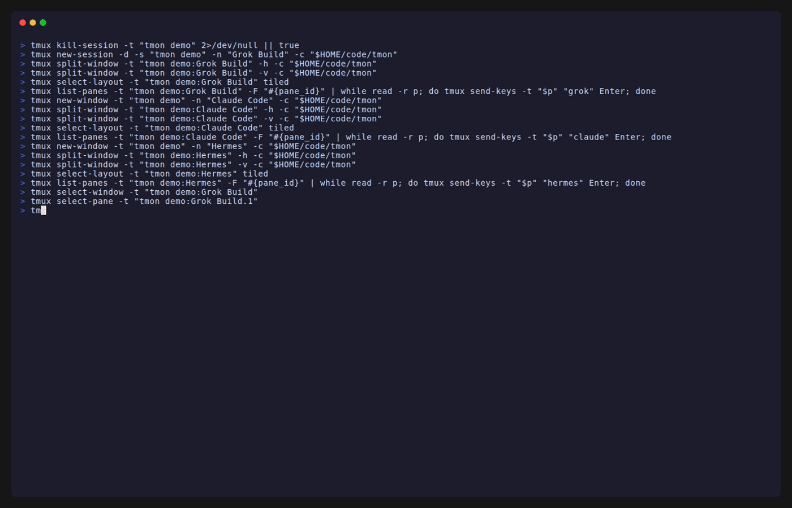

```
▀█▀ █▀▄▀█ █▀█ █▄░█
░█░ █░▀░█ █▄█ █░▀█
```

# tmon — your AI coding agents, now with a leash

```
   ┌─────┐     ┌─────┐     ┌─────┐
   │ ◉ ◉ │     │ ◉ ◉ │     │ ◉ ◉ │
   │  ⌣  │     │  ⌣  │     │  ◠  │
   └─────┘     └─────┘     └─────┘
   ⚡ working   🚨 blocked   💤 idle
```

You've got Grok Build crunching through a refactor in one pane, Claude Code
negotiating a design doc in another, and Hermes Agent off doing… whatever
Hermes Agent does. Wouldn't it be nice to know who's actually working, who's
stuck waiting for your approval, and who's just daydreaming?

tmon sits quietly in your tmux status bar and tells you exactly that. It
finds every running AI coding agent across your panes, tracks whether it's
**working**, **idle**, or **blocked** on you, and shows a compact
color-coded count. Need details? Hit `prefix a a` for an interactive
dashboard — or just **click the status bar indicator**.

[](https://github.com/guillaumemeyer/tmon/releases)
[](LICENSE.md)
[](https://github.com/guillaumemeyer/tmon/actions/workflows/ci.yml)




> **The demo GIF** is recorded with [VHS](https://github.com/charmbracelet/vhs) —
> run [`docs/demo/demo.sh`](docs/demo/demo.sh) (tape + notes in
> [`docs/demo/`](docs/demo/)).

---

## What tmon won't do

- Won't feed them
- Won't explain why Hermes Agent is in `/var/log`
- Won't pair your socks or approve `rm -rf /` for you
- Won't start agents, stop agents, or "just send a quick prompt"
- Won't auto-merge PRs written by three agents at once (we have *some* standards)

tmon is a fleet manager, not a petting zoo.

---

## The Zoo

Every agent in your fleet has a personality, and tmon tells you which one is
currently on stage:

| Status | Icon | What it means | Personality |
|--------|------|---------------|-------------|
| **blocked** | 🚨 | Waiting for a user action: a permission prompt, a plan approval, a y/n question. Overrides everything — a waiting agent is waiting even if it's burning CPU. | *"Waiting for you. It has opinions."* |
| **working** | `\|/-\` | Actively thinking, writing, or running tools — the glyph is an animated spinner. | *"In flow. Do not disturb (unless it's been 40 minutes)."* |
| **idle** | 💤 | Session alive, but not thinking and not waiting on you. | *"Napping between thoughts. Wakes at the first hint of an API call."* |

---

## What you'll see

### Status bar

```
🤖-🚨2-|3-💤1
↑  ↑   ↑   ↑
icon blocked working idle
```

- **🤖 cyan** — your personal fleet of AI agents
- **🚨 orange** — agent is blocked, waiting for you
- **`|` green** — agent is working; the spinner animates, advancing a frame on each status refresh
- **💤 blue** — agent is idle
- **🤖** alone — no agents detected (peace and quiet)

Each status segment (icon + count) only appears when at least one agent is
in that state, so the indicator stays compact. Set `@tmon-ascii-icons "1"`
to swap the emoji for plain ASCII — same colors, same visibility rules
(working agents keep the spinner either way):

```
[@]-B2-|3-I1
↑   ↑  ↑  ↑
app B  |  I
   blocked working idle
```

> **Note:** A brand-new agent shows as **💤 idle** until its first activity
> sample.

### Dashboard (`prefix a a`)

An 80%×80% popup that lists every running agent — one flat row per agent —
with a live pane preview on the right. The tmux popup opens borderless; the
dashboard draws its own **rounded border inside the popup, in the theme's
accent color**, and paints its background from the theme's `bg` slot, so it
reads as a solid themed panel:

```
╭───────────────────────────────────────┬──────────────────────╮
│  🤖 tmon           [/] search [esc/q] quit │  Popup preview scro… │
│ ━━━━━━━━━━━━━━━━━━━━━━━━━━━━━━━━━━━━━━│──────────────────────│
│ / Popup preview scroll (Grok Build)    │  Popup preview scro… │
│  ~/code/tmon  now                     │  $ tmon dashboard    │
│  tmux: main / shell / 0               │  … pane content …    │
│  ctx 52.4k/200k ████████░░… 26%       │                      │
│ 🚨 Claude Code                         │                      │
│  ~/site  paused                       │                      │
│  tmux: main / shell / 1               │                      │
│ 💤 Codex CLI                           │                      │
│  ~/blog                               │                      │
│  tmux: side / code / 0                │                      │
│  v0.4.2     [↑/↓ j/k] navigate  …     │                      │
╰───────────────────────────────────────┴──────────────────────╯
```

Each agent takes four uniform lines: a bold **session title and agent name**
(`Title (Name)`, or just the name when the session has not earned a title
yet) tinted with a **per-agent identity color** (Claude orange, Codex green,
Hermes cyan, …) so the fleet is recognizable at a glance — same color in the
list and the preview header. Working agents animate: their status slot spins
(a green bubbles spinner) instead of the static `⚡️`. Beneath the name, a
dimmed **working directory** plus — when the agent is blocked — the prompt it
is waiting on (e.g. `[y/N]`, or `paused` when the prompt is unknown), then a
dimmed **tmux location** (`tmux: main / shell / 1` — Session / Window / Pane,
each segment preferring the human name and falling back to the numeric
index). When the
connector can read token usage, a fourth **stats line** appears with a
progress-bar context gauge:

```
 / Popup preview scroll (Grok Build)
  ~/code/tmon
  tmux: main / shell / 0
  ctx 52.4k/200k ████████░░░░░░░░░░░░░░░░░░░░░░ 26%
```

The stats line shows the **context window** — tokens used over the model's
window size with a live progress bar and the used percentage (`ctx 13k/200k
████░░… 5%`; the bar and `%` are shown only when the window size is known) —
and, when a connector reports it, the **account quota** as remaining
percentage plus next reset time (`62% left · reset 14:00`). Both are blank
when unknown, and the agent then stays at three lines. What gets populated
today:

| Agent | Stats line |
|-------|------------|
| Grok Build | tokens + window % (from `signals.json`) |
| Claude Code | tokens + window % when the model's window is known (from the transcript) |
| Codex CLI | tokens (from the session history) |
| Hermes Agent | tokens + window % (from CLI/TUI `state.db` session) |
| Others | no stats line — no local usage source |

Filter by status with `b` (blocked), `w` (working), `i` (idle); press the
key again to clear. Hit `Enter` or **click
an agent line** to jump to that agent's pane.

**Fuzzy search** — press `/`, then type a Telescope/fzy-style query. Matches
are subsequences (not substrings) over the session title, agent name,
working directory, and the full pane capture (including content not
currently visible in the preview). Space-separated terms are ANDed. Results
are ranked by match quality. `Esc` leaves search mode (the filter stays);
`Esc` again closes the popup.

| Key / Mouse | Action |
|-----|--------|
| `↑` `↓` / `j` `k` | Navigate the list |
| `←` / `→` / `h` / `l` | Grow / shrink the preview pane (persisted) |
| Drag `│` separator | Resize the preview pane (persisted) |
| `Ctrl-u` / `Ctrl-d` | Scroll the preview up / down |
| `b` / `w` / `i` | Filter by status: blocked / working / idle (press again to clear) |
| `Enter` / `Space` | Jump to the selected agent's pane |
| `t` | Open the theme selector (browse with `↑`/`↓` — previews live; `Enter`/`Space` applies and persists, `Esc`/`q` reverts) |
| Click on an agent line | Select and jump to that agent's pane |
| `/` | Start fuzzy search (session title, name, directory, pane content) |
| Type | Filter the list |
| `Backspace` | Remove last character from filter |
| `Esc` | Leave search mode; if not searching, close popup |
| `q` / `Ctrl-c` | Close popup |

### Supported agents

tmon watches the whole zoo out of the box — **11 agents**:

🤖 Grok Build · ✳️ Claude Code · 🧩 Codex CLI · 🖱️ Cursor · 🧶 Cline · 🦆 Aider · ✨ GitHub Copilot · 🐾 CodeBuddy · 🌊 Windsurf · 👟 Hermes Agent · 🦀 OpenClaw

How closely tmon can track each one depends on the agent's own state
surface. Agents that publish live state files (Grok, Hermes, Cline,
CodeBuddy, Aider, OpenClaw) or accept lifecycle hooks (Claude Code, Codex,
Cursor, Copilot, Windsurf, Hermes approvals) give tmon authoritative working
/ blocked / idle signals; everyone else falls back to the CPU/IO and
pane-content heuristics. The matrix below shows which features each agent's
connector provides:

| Agent | Connector | Status | Blocked | Detail | Title | Tokens |
|-------|-----------|--------|:---:|--------|:---:|:---:|
| Grok Build | native (`~/.grok`) | exact | ✓ | phase · tool · permission · model | ✓ | ✓ + window % |
| Claude Code | hooks | exact | ✓ | tool · permission | ✓ | ✓ + window % |
| Codex CLI | hooks (+ `/hooks` trust) | exact | ✓ | tool · permission | — | ✓ |
| Hermes Agent | native (`~/.hermes` + profiles) | CLI/TUI | ✓ (hooks) | model · approval | ✓ | ✓ + window % |
| GitHub Copilot | hooks, else native fallback | exact | ✓ | tool · permission | — | — |
| Cursor | hooks, else native fallback | exact | — | tool | — | — |
| Windsurf | hooks | exact | — | tool | — | — |
| Cline | native (`~/.cline`) | working | — | session id | — | — |
| CodeBuddy | native (`~/.codebuddy`) | idle | — | session id | — | — |
| Aider | native (`.aider.chat.history.md`) | working | — | editing | — | — |
| OpenClaw | native (`~/.openclaw` + gateway lock) | gateway | — | gateway · N active sessions | — | — |

**Status** is how precisely tmon knows the working / blocked / idle state:
`exact` from the agent's own signals, a partial signal (`working`, `idle`,
`gateway`, `CLI/TUI`), or `heuristic` (CPU/IO inference). **Blocked** marks
connectors that detect a permission wait themselves; a — falls back to the
pane-pattern heuristic (`[y/N]`, permission prompts, …). **Detail** is what
the dashboard shows under the agent's name, **Title** the session name
("Title (Agent)"), and **Tokens** the stats line (tokens + context-window %
when known).

**Hermes** lists only live **CLI/TUI** sessions (not the messaging gateway).
The dashboard name is `Title (Hermes - <profile>)` when a profile is known
(default home or `~/.hermes/profiles/<name>`). Session title, model, and
token stats come from each home's `state.db`. Dangerous-command waits become
**blocked** when approval hooks are installed (`tmon hooks install hermes`);
Hermes may prompt once to allowlist the shell hook.

Hooks install automatically at plugin load unless `@tmon-auto-hooks` is
`off` — or by hand with `tmon hooks install <agent>`. Codex additionally
requires the hooks to be trusted in-session via `/hooks`. Without hooks, the
Cursor/Copilot native fallback only reports the agent as idle.

### Add your agent

Missing your favorite agent? The connector interface is about **15 lines** —
`Name()`, `Enabled()`, `Probe()` — and community connectors are how the
fleet grows (same playbook that made TPM the default tmux plugin story).

See **[CONTRIBUTING.md](CONTRIBUTING.md)** for a copy-paste template, the
detect-signature checklist, and how to land a PR.

### Scripting with JSON (`tmon status --json`)

For status bars that aren't tmux (polybar, i3blocks, a shell prompt),
`tmon status --json` prints the full poll result: every agent with its
status, pane, working directory, phase detail and token usage.

```bash
tmon status --json
```

```json
{
  "statuses": ["working", "idle"],
  "agents": [
    {
      "pid": 12345,
      "label": "Grok",
      "status": "working",
      "pane": "main:0.2",
      "cwd": "code/tmon",
      "detail": "tool:Bash",
      "usage": { "tokensUsed": 52397, "windowTokens": 200000 }
    }
  ]
}
```

Pipe it through `jq` for exactly what you need:

```bash
# All agents currently blocked on you:
tmon status --json | jq '.agents[] | select(.status=="blocked")'

# Total blocked count for a polybar module:
tmon status --json | jq '[.agents[] | select(.status=="blocked")] | length'

# Working directories of everything in flow:
tmon status --json | jq -r '.agents[] | select(.status=="working") | .cwd'
```

---

## Requirements

- **Linux or macOS** (amd64 or arm64)
- **tmux ≥ 3.2** (tested on 3.4)
- A downloader and checksum tool used once on first load:
  - download: **curl** or **wget**
  - verify: **sha256sum** (Linux) or **shasum** (macOS)
- **Network on first load** — the binary is downloaded from GitHub Releases;
  afterwards it lives in the plugin directory

### Windows

Native Windows is not supported, and the Windows build has not been tested.
Use **WSL2** with tmux and install tmon
*inside* the Linux environment (plugin under the Linux home, e.g.
`~/.tmux/plugins/tmon` — avoid `/mnt/c/...` when you can). Bootstrap fetches
the Linux binary; agents must also run as Linux processes in WSL for
detection to see them.

---

## Installation

### One-liner

```bash
curl -fsSL https://raw.githubusercontent.com/guillaumemeyer/tmon/main/install.sh | sh
```

Detects whether TPM manages your tmux config or not, clones the plugin
(updating an existing checkout), wires `~/.tmux.conf`, and reloads tmux if
you're inside it. Safe to re-run.

### 1. Agent install (recommended)

Paste this into your coding agent (Grok Build, Claude Code, Codex, …) and let
it wire up your tmux config:

```
Install the tmux plugin guillaumemeyer/tmon for me.

1. Check whether TPM (Tmux Plugin Manager) is installed:
   - Look for ~/.tmux/plugins/tpm (or whatever path run '~/.tmux/plugins/tpm/tpm'
     would use), and whether ~/.tmux.conf already loads TPM via
     `run '.../tpm/tpm'`.
2. If TPM is installed (or you can install it cleanly):
   - Add this line to ~/.tmux.conf if it is not already present:
       set -g @plugin 'guillaumemeyer/tmon'
   - Ensure the TPM initializer is the **last** line of ~/.tmux.conf:
       run '~/.tmux/plugins/tpm/tpm'
   - If TPM itself is missing, clone it first:
       git clone https://github.com/tmux-plugins/tpm ~/.tmux/plugins/tpm
   - Then install plugins (TPM: prefix + I, or run the TPM install scripts).
3. If TPM is not available and should not be installed, do a manual install:
   - git clone https://github.com/guillaumemeyer/tmon ~/.tmux/plugins/tmon
   - Add to ~/.tmux.conf if missing:
       run-shell ~/.tmux/plugins/tmon/tmon.tmux
4. Reload: tmux source-file ~/.tmux.conf
5. Confirm success: the plugin dir exists and, on first load, bootstrap
   downloads the binary into ~/.tmux/plugins/tmon/bin/tmon (status message
   like "tmon: installed v…"). Report what you changed.
```

On first load, tmon downloads its binary into `<plugin>/bin/` — you'll see a
one-line status-bar message such as `tmon: installed v0.4.2 (linux/amd64)`.

### 2. Manual install

#### With TPM

```tmux
# ~/.tmux.conf
set -g @plugin 'guillaumemeyer/tmon'
```

Then `prefix I` to install.

If you're setting up TPM for the first time, clone it and keep the initializer
at the **very bottom** of `~/.tmux.conf`:

```bash
git clone https://github.com/tmux-plugins/tpm ~/.tmux/plugins/tpm
```

```tmux
# Initialize TMUX plugin manager (keep this line at the very bottom of tmux.conf)
run '~/.tmux/plugins/tpm/tpm'
```

Reload: `tmux source-file ~/.tmux.conf`, then `prefix I` if plugins are not
installed yet.

#### Without TPM

```bash
git clone https://github.com/guillaumemeyer/tmon ~/.tmux/plugins/tmon
```

```tmux
# ~/.tmux.conf
run-shell ~/.tmux/plugins/tmon/tmon.tmux
```

Reload: `tmux source-file ~/.tmux.conf`. On first load, tmon downloads its
binary into `<plugin>/bin/` — you'll see a one-line
`tmon: installed v0.4.2 (linux/amd64)` (or `darwin/arm64`, etc.) status-bar
message.

### Updating

TPM: hit `prefix U` (uppercase). tmon installs a git `post-merge` hook in the
plugin repo, so the pull itself re-downloads the binary matching the new
`VERSION` and re-applies the tmux wiring — no reload needed. If the hook
cannot run (e.g. the plugin is not a git clone), fall back to
`prefix U`, then `tmux source-file ~/.tmux.conf`.

Manual installs: `git pull origin main` (the same hook applies).

---

## Configuration

Set any of these in `~/.tmux.conf` **before** the plugin line. All of them
are optional — the defaults are sensible for most people.

| Option | Default | What it does |
|--------|---------|--------------|
| `@tmon-status-position` | `right` | Which side of the status bar carries the indicator |
| `@tmon-poll-interval` | `3000` | ms between agent scans |
| `@tmon-activity-threshold` | `500` | CPU ms/s to call an agent "working" |
| `@tmon-io-threshold` | `102400` | min IO bytes/poll to call an agent "working" |
| `@tmon-dashboard-key` | `a` | chord leader for the popup (`prefix <key> <key>`) |
| `@tmon-connectors` | `auto` | which connectors to enable (`auto` or a comma list) |
| `@tmon-connector-freshness` | `30` | seconds a connector signal stays authoritative |
| `@tmon-auto-hooks` | `on` | auto-install lifecycle hooks at plugin load |
| `@tmon-ascii-icons` | `0` | `1` renders icons as ASCII (`[@] B I`; working agents keep the spinner) |
| `@tmon-bold-counts` | `1` | bold the per-status counts |
| `@tmon-context-warn` | `85` | context % at which a ⚠️ warning appears (`0` disables) |
| `@tmon-blocked-bell` | `off` | ring the bell when an agent transitions to blocked |
| `@tmon-pane-border` | `on` | status-colored border strip on agent panes (blocked/working) |
| `@tmon-pane-border-position` | `top` | where the strip sits (`top` or `bottom`) |
| `@tmon-color-<slot>` | — | override one theme color slot |
| `@tmon-icon-<slot>` | — | override one status glyph |

### `@tmon-poll-interval`

> How often tmon scans for agents and samples their activity.

| | |
|---|---|
| **Default** | `3000` |
| **Unit** | milliseconds |
| **Range** | `1000`–`60000` (1s to 60s) |

```tmux
set -g @tmon-poll-interval "5000"   # every 5 seconds
```

### `@tmon-activity-threshold`

> CPU sensitivity for calling an agent "working." Lower values are more
> sensitive to light activity.

| | |
|---|---|
| **Default** | `500` |
| **Unit** | CPU milliseconds per second |
| **Range** | `100`–`5000` |

```tmux
set -g @tmon-activity-threshold "200"   # more sensitive
```

### `@tmon-io-threshold`

> IO sensitivity for calling an agent "working." Lower values pick up lighter
> file and stream activity.

| | |
|---|---|
| **Default** | `102400` |
| **Unit** | bytes per poll interval |
| **Range** | `1024`–`10485760` |

```tmux
set -g @tmon-io-threshold "51200"  # more sensitive to IO
```

### `@tmon-status-position`

> Which side of your status bar gets the tmon indicator.

| | |
|---|---|
| **Default** | `right` |
| **Options** | `right` or `left` |

```tmux
set -g @tmon-status-position "left"
```

### `@tmon-dashboard-key`

> The chord leader key for opening the agent navigation popup.
> Opens with `prefix <key> <key>`.

| | |
|---|---|
| **Default** | `a` |
| **Example binding** | `prefix a a` → navigation |

```tmux
set -g @tmon-dashboard-key "b"   # use prefix b b instead
```

### `@tmon-connectors`

> Which agent connectors to enable. Connectors use each agent's own status
> signals (when available) for more accurate working / blocked / idle state.

| | |
|---|---|
| **Default** | `auto` |
| **Options** | `auto` (every connector whose agent is installed) or a comma list, e.g. `grok,claude` |

```tmux
set -g @tmon-connectors "grok,hermes"   # only these two connectors
```

### `@tmon-connector-freshness`

> How long a connector's status signal stays valid before tmon falls back to
> activity-based detection.

| | |
|---|---|
| **Default** | `30` |
| **Unit** | seconds |

```tmux
set -g @tmon-connector-freshness "60"   # keep connector state longer
```

### `@tmon-auto-hooks`

> Auto-install lifecycle hooks at plugin load for agents that need them
> (Claude Code, Codex, Cursor, Copilot, Windsurf). Install is idempotent and
> backs up each config once (`.tmon.bak`) before the first change. Set `off`
> to manage hooks by hand.

| | |
|---|---|
| **Default** | `on` |
| **Options** | `on` or `off` |

```tmux
set -g @tmon-auto-hooks off   # manage hooks manually
```

Manual hook install (if auto-hooks are off):

```bash
~/.tmux/plugins/tmon/bin/tmon hooks install claude
~/.tmux/plugins/tmon/bin/tmon hooks install codex     # also run /hooks once inside Codex to trust them
~/.tmux/plugins/tmon/bin/tmon hooks install cursor
~/.tmux/plugins/tmon/bin/tmon hooks install copilot
~/.tmux/plugins/tmon/bin/tmon hooks install windsurf
```

`tmon hooks remove <agent>` undoes an install; `tmon hooks status` lists
what's installed. Hooks are optional — without them, agents still appear via
activity detection.

### `@tmon-ascii-icons`

> Render status icons as plain ASCII instead of emoji.

| | |
|---|---|
| **Default** | `0` |
| **Options** | `0` (emoji) or `1` (ASCII) |

```tmux
set -g @tmon-ascii-icons "1"   # [@]-B2-|3-I1 instead of 🤖-🚨2-|3-💤1
```

### `@tmon-bold-counts`

> Render the per-status counts (the `2` in `🚨2`) in bold.

| | |
|---|---|
| **Default** | `1` |
| **Options** | `0` (normal weight) or `1` (bold) |

```tmux
set -g @tmon-bold-counts "0"
```

### `@tmon-context-warn`

> When any agent's context-window usage reaches this percent, the status bar
> appends a ⚠️ warning (in the theme's `warn` color) and the dashboard's
> usage bar turns yellow. `0` disables the warning.

| | |
|---|---|
| **Default** | `85` |
| **Options** | any percent, or `0` to disable |

```tmux
set -g @tmon-context-warn "90"
```

### `@tmon-blocked-bell`

> Ring the terminal bell when an agent transitions to **blocked** — useful
> when the status bar is out of view. The bell only fires on transitions,
> never on steady state, and only in the daemon path (`tmon daemon --notify`);
> `tmon status` is transition-free by design.

| | |
|---|---|
| **Default** | `off` |
| **Options** | `on` or `off` |

```tmux
set -g @tmon-blocked-bell "on"
```

### `@tmon-pane-border`

> Draw a short status strip on each agent pane's border — themed icon and
> status word in the blocked or working color — so you can spot waiting or
> busy agents without reading the pane. Idle agents clear the strip so the
> border returns to its default (empty) appearance; when an agent exits, its
> strip is removed. This uses tmux's `pane-border-status` line (not the
> box-drawing edges, which tmux only styles as active vs inactive). While the
> feature is on, tmon owns `pane-border-status` and `pane-border-format`
> globally — turn it off (or run `tmon border off`) to restore the default
> border chrome. Non-agent panes get an empty strip for as long as the
> feature is enabled.

| | |
|---|---|
| **Default** | `on` |
| **Options** | `on` or `off` |

```tmux
set -g @tmon-pane-border "on"             # default; set "off" to disable
set -g @tmon-pane-border-position "top"   # or "bottom"
```

---

## Themes

tmon ships with color themes for both the status bar and the dashboard:

`default` · `catppuccin` · `nord` · `dracula` · `tokyonight` · `gruvbox` · `solarized` · `onedark`

The theme is chosen live from the dashboard: press `t` inside the popup to
open the theme selector — a list of presets on the left with the selected
theme's color palette previewed on the right. Browsing the list applies the
highlighted theme to the whole popup as a live preview. `Enter` or `Space`
applies and persists the theme (it writes `state/theme` and updates
`TMON_THEME` in the global environment and every live session — session
env otherwise shadows a global-only update). On the next tmux start or
plugin reload, tmon restores from `state/theme`; the binary also reads
that file directly so a stale session env cannot wipe the choice); `Esc`
or `q` closes the selector and reverts to the theme that was active before.

Preview a theme's colors straight from the terminal (swatches plus a sample
status line):

```bash
~/.tmux/plugins/tmon/bin/tmon theme preview nord
```

`tmon theme` (no arguments) lists all presets.

Fine-tune any theme with per-slot overrides. `@tmon-color-<slot>` accepts a
tmux color — a name (`red`), an indexed color (`colour208`), or hex
(`#ff5555`) — for the slots `bg` (the dashboard popup's background panel),
`app`, `blocked`, `working`, `idle`, `dim`, `accent` (the popup's rounded
border and highlights), `warn`, `selbg`.
`@tmon-icon-<slot>` swaps a status glyph for `app`, `blocked`, `idle`, or
`warn` (working agents show the animated spinner in the theme's `working`
color instead of an icon):

```tmux
set -g @tmon-color-bg "#1e1e2e"
set -g @tmon-color-blocked "#ff5555"
set -g @tmon-icon-idle "😴"
set -g @tmon-icon-app "@"    # ASCII-only crowd
```

---

## Notifications

tmon can send tmux popups when an agent becomes blocked, working, or idle.
Run the daemon in notify mode:

```bash
~/.tmux/plugins/tmon/bin/tmon daemon --notify
```

Notifications are opt-in and off by default. To start them with tmux, add
to `~/.tmux.conf`:

```tmux
run-shell -b "~/.tmux/plugins/tmon/bin/tmon daemon --notify"
```

---

## Keybindings

| Binding | Action |
|---------|--------|
| `prefix a a` | Open the agent navigation popup |
| Click status bar indicator | Open the agent navigation popup |

---

## Troubleshooting

**Something's off? Run `tmon doctor` first** — it checks everything at once
(tmux ≥ 3.2, downloader + checksum tools, binary vs. `VERSION`, writable
state dir, running agents, connector and hook status) and prints a ✓/✗
report with a non-zero exit code when anything fails:

```bash
~/.tmux/plugins/tmon/bin/tmon doctor        # text report
~/.tmux/plugins/tmon/bin/tmon doctor --json # machine-readable, for CI
```

**Status bar is empty** — tmon only renders when agents are detected. Fire up
an agent and it should appear. Still nothing? Run:

```bash
~/.tmux/plugins/tmon/bin/tmon status
```

**Dashboard won't open** — Check your keybinding: `tmux list-keys -T a-table`.
If `a` conflicts with another plugin, change `@tmon-dashboard-key`.

**Agent shows as "?" instead of a pane path** — The agent couldn't be mapped
to a tmux pane (e.g. headless or outside tmux). Harmless — the status bar
still tracks it.

**High CPU from tmon** — Increase `@tmon-poll-interval` (e.g. to `10000`).

**Stale agent counts after crash** — delete the state file and let it rebuild:

```bash
rm ~/.tmux/plugins/tmon/state/state.json
```

**Binary won't download** — needs network access to GitHub Releases. Check
connectivity, then from the plugin directory run `scripts/bootstrap.sh`
manually — it prints the failure reason.

---

## FAQ

**Will tmon write my code for me?**
No. It just watches the robots that do. It's a leash, not a robot arm.

**Does tmon phone home?**
No. Everything runs locally; the only network call is the one-time binary
download on first load.

**Why is there an emoji in my status bar?**
Because your agents are watching too. Set `@tmon-ascii-icons "1"` if you
need dignity.

**My agent is blocked but tmon doesn't know it.**
If its prompt is an unusual permission flow, the pane-pattern heuristic may
miss it — a connector for that agent fixes it (`tmon hooks install <agent>`
or check the [connector matrix](#supported-agents)). When in doubt,
`tmon doctor`.

**Why do my robots keep asking for approval?**
Because they respect you. Cherish it.

**Does it work with Claude Code? Codex? Cursor?**
Eleven agents and counting — see [Supported agents](#supported-agents).

**Can I use it without tmux?**
No — but `tmon status --json` feeds any status bar that can run a command.

---

## Testimonials

> "I didn't know my agents were blocked until tmon told me. My agents still don't know."
> — Someone with 14 panes and one coffee

> "Finally, a tool that judges my agent fleet without judging *me*."
> — A human who definitely approved that plan

> "`prefix a a` is muscle memory now. My left pinky is a stakeholder."
> — Terminal-native

> "I used to `tmux list-panes` and pray. Now I pray less and click more."
> — Reformed pane spelunker

> "Supports 11 agents. I only run two. The other nine live rent-free in the README."
> — Minimalist with FOMO

> "Zero-config means I configured nothing and it still found Claude waiting on `[y/N]`. Rude. Accurate."
> — Permission-prompt survivor

*Testimonials may be fictional. Agents cannot sue.*

---

## Libraries

tmon is built on a short stack of excellent Go libraries:

- [Bubble Tea](https://github.com/charmbracelet/bubbletea) — the dashboard TUI
- [Lip Gloss](https://github.com/charmbracelet/lipgloss) — styles and layout
- [charmbracelet/x/ansi](https://github.com/charmbracelet/x/ansi) — ANSI width and truncation
- [golang.org/x/sys](https://github.com/golang/sys) — process / OS bits

---

## License

MIT — because the robots haven't taken over yet.
